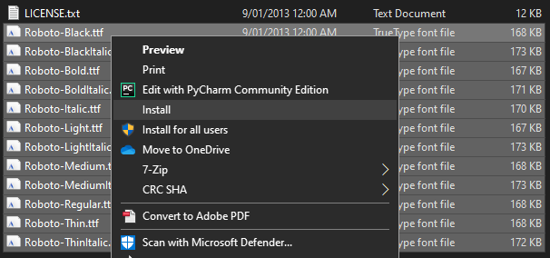
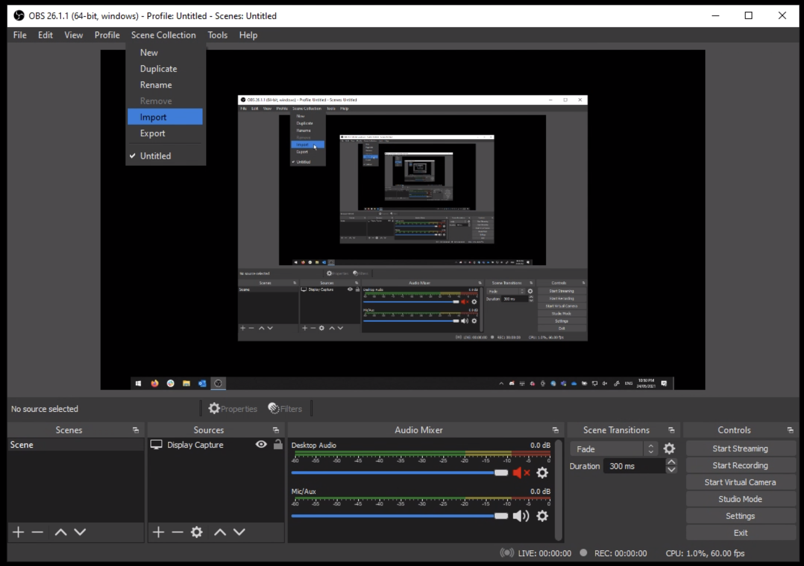
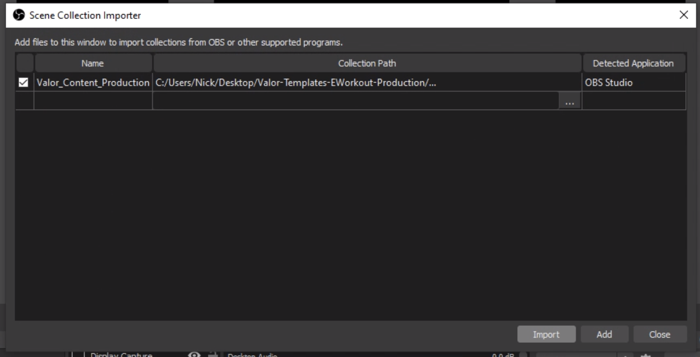
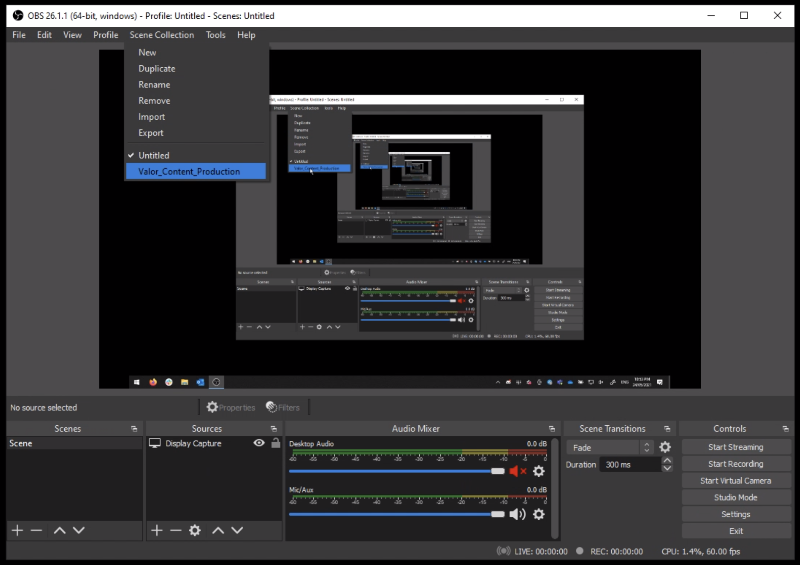
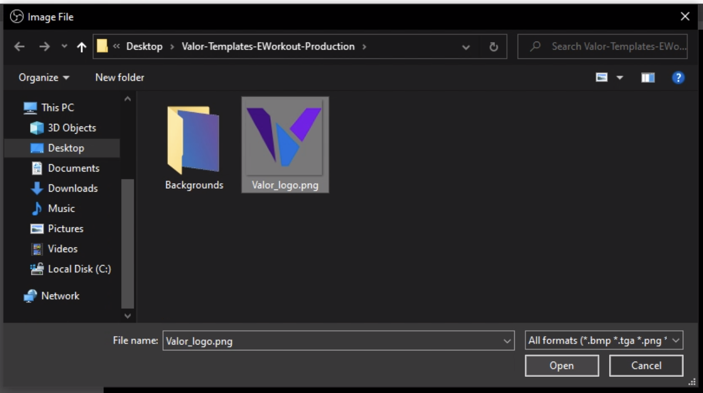

# OBS Scene Collection

## Set up OBS

**If you haven't already** installed it, follow [this guide](../setting-up-obs) to get set up with OBS.

## Download the EWorkout Production package

You should have been sent a file named `Valor-Templates-EWorkout-Production.zip` or similar. **Extract the ZIP file** somewhere you won't lose it, for example your desktop folder.

## Install the Roboto font

:::info
[Roboto](https://fonts.google.com/specimen/Roboto) is [licensed](https://fonts.google.com/specimen/Roboto#license) under the [Apache License, Version 2.0](https://www.apache.org/licenses/LICENSE-2.0).
:::

Inside the `Valor-Templates-EWorkout-Production` folder, you will see a `Roboto.zip` file. **Extract it** and you will be left with a number of `Roboto-*.ttf` files.

### Windows

On Windows, you can install all fonts at once by **selecting them all, right clicking, and choosing either `Install` or `Install for all users`**.

### macOS

On macOS, you can install all fonts at once by **selecting them all, right clicking, and then choosing `Open With > Font Book`**.

This will open a preview window, where you must **click `Install Font` at the bottom right**.

## Import the Scene Collection into OBS

In OBS Studio, navigate to `Scene Collection > Import` using the menu bar at the top.

The Scene Collection Importer window will open. Click the `Add` button at the bottom right.

Browse to the location you extracted the ZIP file, and **open the JSON file**.

Then, click `Import` at the bottom right of the Scene Collection Importer window.

You should now be able to navigate to `Scene Collection > Valor_Content_Production` using the menu bar.

You should see the basic Valor EWorkout scenes appear on your screen! Under "Sources" near the bottom right you can double click the `Title` and `Subtitle or description` text sources to edit their contents. Be aware though that before you can start recording you will need to re-import **three (three)** files.

## Re-import image files

Click on the `Valor logo` image source and when the `Image File` field appears under the video preview, **click browse at the right**.

Browse to the location you extracted the ZIP file, and **open `Valor_logo.png`**. **You will need to repeat this for the `Valor gradient` and `Game backdrop` image sources**, although those files are in the `Backgrounds` folder. You can choose whichever game backdrop image you like, or use one of your own (_so long as it's community friendly of course_).

## Done

**Now you're set to start shooting!**
