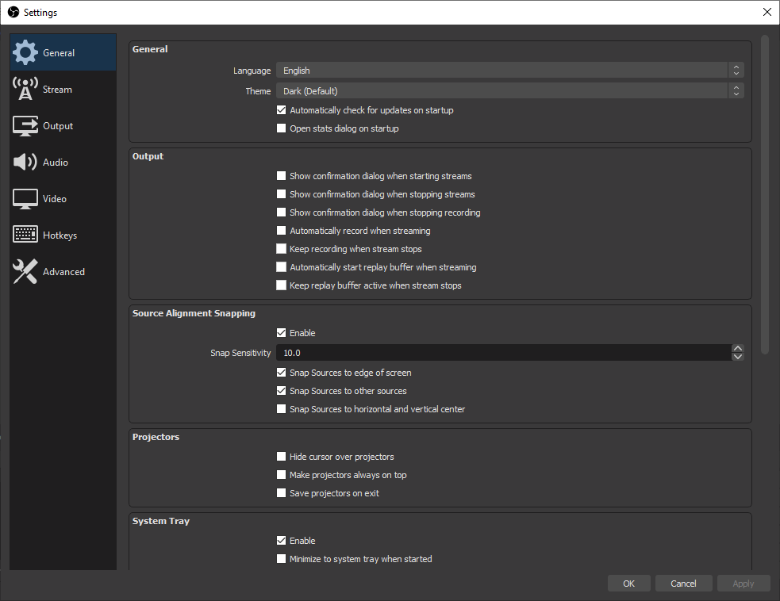
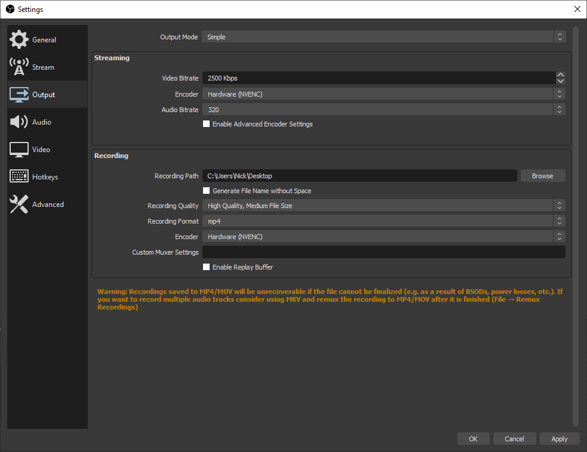
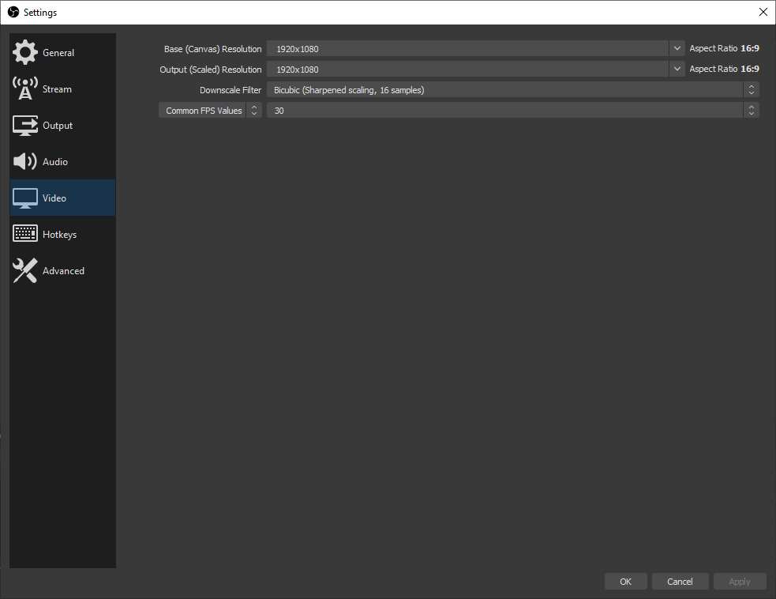

# Setting up OBS Studio

## Download and install OBS

OBS Studio is free and open source software. You can download it from [https://obsproject.com/download](https://obsproject.com/download).

:::caution

Please note that OBS Studio <u>is not Streamlabs OBS</u>, which is similar to OBS Studio but offers <u>less</u> options around bitrate. **If you choose to use Streamlabs OBS, you may end up with larger video files**.

:::

## Configure recording output

### Open settings

When you open OBS, it should look something like this:

**Just above** the `Exit` button in the bottom right of the window, you'll see a `Settings` button. **Click it**.

### Configure settings

The settings window looks something like this:

We are interested in the `Output`, `Audio`, and `Video` tabs in the left sidebar.

#### Output

Make sure `Output Mode` is set to `Simple`. **Under the `Recording` heading**, choose your desired `Recording Path`, and set `Recording Quality` to `High Quality, Medium File Size`. Set `Recording Format` to `mp4`. **If you have the option**, set your `Encoder` to `Hardware`. If not, stick with Software although it may cause performance issues.

#### Audio

Make sure your `Sample Rate` is `44.1kHz`. Sometimes OBS Studio sets this to `48kHz` which results in larger files. This is unnecessary as there is practically no difference between a 44.1kHz and a 48kHz audio file.

#### Video

Make sure the `Base (Canvas)` and `Output (Scaled)` resolutions are set to `1920x1080`. **Also make sure your FPS is 30**.

